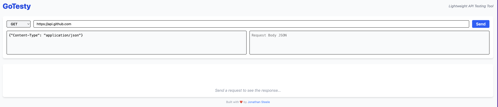

# GoTesty

<p align="center">
  
  
  
  
  
  <br/>
  
  
  
  <br/>
  
  
</p>

GoTesty is a lightweight, full-stack desktop and web tool for testing RESTful APIs.
Built with Go, Wails, React, and TailwindCSS, it delivers a native-feeling API client without the overhead of heavyweight tools like Postman.

Designed for developers who want speed, clarity, and control across the entire stack.

## Why GoTesty?

GoTesty bridges backend performance with a modern frontend experience:
- Fast — Go-powered HTTP engine
- Simple — focused feature set, no clutter
- Full-stack — backend logic + frontend UI in one cohesive app
- Native — compiled binaries via Wails
- Portable — desktop-first, web-ready architecture

## Features

- Built-in request builder (GET, POST, PUT, DELETE)
- Custom headers and body support
- Pretty JSON output viewer
- Clean, minimal UI with TailwindCSS
- Cross-platform (macOS, Windows, Linux)
- Powered by Go + Wails for a native feel

## Screenshot


## Tech Stack

| Layer | Technology |
|--------|-------------|
| Backend | Go + Wails |
| Frontend | React + Vite |
| Styling | TailwindCSS |
| Packaging | Wails CLI |

## Getting Started

### Prerequisites
- [Go 1.23+](https://go.dev/dl/)
- [Node.js 18+](https://nodejs.org/)
- [Wails CLI](https://wails.io/docs/gettingstarted/installation)

### Clone & Run

```bash
git clone https://github.com/jonathansteele/gotesty.git
cd gotesty
wails dev
```
### Build for Production
```bash
wails build
```
Output binaries will appear in the ```/bin``` folder.
